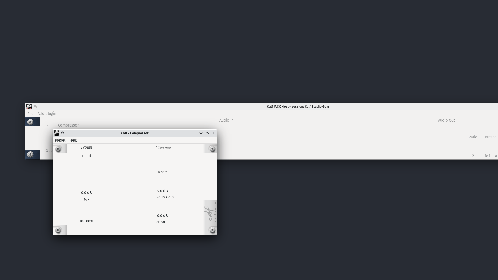
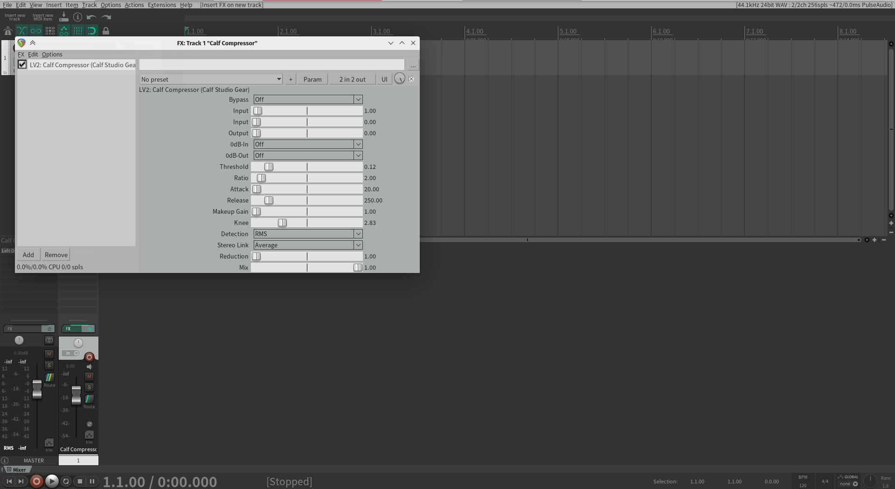

# An experiment to port Calf to GTK 3 so that maybe it works in REAPER

Status: it builds with GTK 3 and can be loaded without crashing. DSP seems unaffected. However, graphics are not rendering properly even though they can be interacted with. This has also not been enough to get the custom GUI to show up in REAPER.

I have concluded this attempt.



---

## Why

REAPER supports LV2 plugins, but some plugins, including Calf, lose their custom GUI. The GUI exists to guide the user, and by doing that influences the sound and defines the workflow. Without a custom GUI, a plugin does not just look worse, it also becomes harder to get the desired sound out of it.

Calf's GUI is made with GTK 2, while REAPER seems to be built against GTK 3. As the GTK 2 → GTK 3 migration guide mentions, linking against both major versions of GTK in the same program — which happens when a GTK 2 plugin is loaded in a GTK 3 host — does not work. (It seems that Ardour is fine because it is built against GTK 2. I don't know how Zrythm (GTK 4) gets around this.)

So my hypothesis is that if Calf were to be ported to GTK 2, which should be considerably less effort than, say, porting to JUCE, REAPER would be able to load it.

## Process

I first merged [#290](https://github.com/calf-studio-gear/calf/pull/290) into this branch because otherwise the build cannot be loaded anywhere, not even in Ardour.

Then I added rudimentary CI through GitHub Actions: on push to `master`, the CI would check out the repository, install dependencies, then run `./autogen.sh; make`. This just makes sure it builds.

Some minor things: [d2ec41b0](https://github.com/kisaragi-hiu/calf-gtk3-experiment/commit/d2ec41b0ed1a21ed99dad960cc109989123c3631) addresses a compiler warning, while [8537fab7](https://github.com/kisaragi-hiu/calf-gtk3-experiment/commit/8537fab7ec74d2977185b4e1fcad8d06a4642866) replaces `gtk_widget_hide_all` with just `gtk_widget_hide`

Generally, I tried to follow the GTK 2 → GTK 3 migration guide. I set up npm as my secondary task runner and created a *wip* task that runs this:

```shell
bear -- \
    make -j8 \
    CPPFLAGS+='-DGTK_DISABLE_SINGLE_INCLUDES' \
    CPPFLAGS+='-DGDK_DISABLE_DEPRECATED -DGTK_DISABLE_DEPRECATED' \
    CPPFLAGS+='-DGSEAL_ENABLE' \
    CPPFLAGS+='-Wno-deprecated-declarations' \
    CPPFLAGS+='-Wno-parentheses'
```

This runs Make through [Bear](https://github.com/rizsotto/Bear) to set up `compile_commands.json` for Clangd to work. The `-D` flags turn GTK deprecations into compile time errors so that they can be addressed, and I also turn off some warnings that I was already going to ignore.

The process is then roughly as follows:

1. [77de5ac3](https://github.com/kisaragi-hiu/calf-gtk3-experiment/commit/77de5ac3603846c8e4598e0f08bcb4e04359a395)
   - Move away from `GTK_WIDGET_SET_FLAGS`
   - `gtk_spin_button_get_value_as_float` → `gtk_spin_button_get_value`
   - `g_signal_connect` instead of `gtk_signal_connect`, `G_CALLBACK` instead of `GTK_SIGNAL_FUNC`
   -  `gtk_timeout_add` → `g_timeout_add`, `gtk_timeout_remove` → `gtk_source_remove`, `GtkFunction` → `GSourceFunc`
2. [13aae359](https://github.com/kisaragi-hiu/calf-gtk3-experiment/commit/13aae3590e7711025d31bdee45912589aa11c12d)
   - Move from `gdk_draw_pixbuf` to Cairo surfaces (the clipping part is in [d6e373bc](https://github.com/kisaragi-hiu/calf-gtk3-experiment/commit/d6e373bc3c356c9d5631b81eba60308b872a48a7))
     ```cpp
     // Before
     gdk_draw_pixbuf(GDK_DRAWABLE(widget->window), widget->style->fg_gc[0],
                     self->toggle_image, 0, sy, x, y, pw, ph / 2, GDK_RGB_DITHER_NORMAL, 0, 0);
     // gdk_draw_pixbuf(*drawable, *gc, *pixbuf,
     //                 src_x, src_y, dest_x, dest_y,
     //                 width, height,
     //                 dither, x_dither, y_dither);

     // After
     cairo_t *cr = gdk_cairo_create (GDK_DRAWABLE(widget->window));
     gdk_cairo_set_source_pixbuf (cr, self->toggle_image, x, y - sy);
     // Note how gdk_cairo_set_source_pixbuf only has one pair of (x, y).
     // Using (y - sy) achieves the same effect, though it has to be
     // clipped off before painting:
     GdkRectangle rect = {(gint)x, (gint)y, (gint)pw, (gint)(ph / 2)};
     gdk_cairo_rectangle(cr, &rect);
     cairo_clip(cr);
     // Now do the actual painting
     cairo_paint (cr);
     cairo_destroy (cr);
     ```
3. [165af4bf](https://github.com/kisaragi-hiu/calf-gtk3-experiment/commit/165af4bfc33d01f80ab2f1acb8002955baaf71cf)
   - Move away from GtkNotebookPage. The current page is now an index (int), rather than a GtkNotebookPage object.
4. [165af4bf](https://github.com/kisaragi-hiu/calf-gtk3-experiment/commit/165af4bfc33d01f80ab2f1acb8002955baaf71cf), [9af54596](https://github.com/kisaragi-hiu/calf-gtk3-experiment/commit/9af545963897e3a138b88ba02dd445b9ed8f2ea6), [a2c32605](https://github.com/kisaragi-hiu/calf-gtk3-experiment/commit/a2c326056e9f3909804c470d36827a9354b93400), [4c229b21](https://github.com/kisaragi-hiu/calf-gtk3-experiment/commit/4c229b2170d9d494be213f14de28009bad21ade8), [ff86015c](https://github.com/kisaragi-hiu/calf-gtk3-experiment/commit/ff86015c2765cac7fa81be9064f4829bec73db4b)
   - Move to getter and setter functions instead of directly accessing an object's properties (with `->`).

     Sometimes this is easy and there is literally a corresponding (more wordy) function; other times it can be replaced with a few lines more code *per use* (like getting or setting GtkAllocation, or getting GtkRequisition).

     I have no idea what directly setting GtkRequisition is supposed to be replaced with.

   - GtkAllocation stuff: it needs to be moved to an accessor, so

     ```cpp
     int lx = widget->allocation.x;
     ```

     has to become

     ```cpp
     GtkAllocation allocation;
     gtk_widget_get_allocation(widget, &allocation);
     int lx = allocation.x;
     ```

     . No, I don't know if the GtkAllocation should be freed manually or not.

At this point it still builds with GTK 2 without the `-DGSEAL_ENABLE` option (turn deprecated direct property access into errors), but I just don't know what to do with GtkRequisition writes (such as `widget->requisition.width = 40`). The GUI still looks the same at this point, although I have no idea whether I've introduced memory leaks or not.

I then modified `configure.ac` to move straight to GTK 3 in [0c753620](https://github.com/kisaragi-hiu/calf-gtk3-experiment/commit/0c753620d1bd6f5c38b02993e932227ab6e82466).

After starting to attempt to build with GTK 3:

1. [c5f5dc99](https://github.com/kisaragi-hiu/calf-gtk3-experiment/commit/c5f5dc99780612b45f3839c4a68687843a29c6e3)
   - calls to `GDK_DRAWABLE` can simply be unwrapped
2. [10cd4d32](https://github.com/kisaragi-hiu/calf-gtk3-experiment/commit/10cd4d32472d7a3482494cfbbd724c2f968a64dc)
   - I attempted to port a function (`clip_context` in `drawingutils`) to use `cairo_region_t` instead of GdkRegion
3. [892c6cd0](https://github.com/kisaragi-hiu/calf-gtk3-experiment/commit/892c6cd0873b1215b0d16c80f9a68ed1ea61d5bf), [68b561df](https://github.com/kisaragi-hiu/calf-gtk3-experiment/commit/68b561df2dc785735c88c8c0691f9fbaf1d9710c), [28019ef3](https://github.com/kisaragi-hiu/calf-gtk3-experiment/commit/28019ef3fb076d97c2e2f5c394d393569d577ad1)
   - The first argument to `g_signal_connect` doesn't need to be wrapped in a call to `GTK_OBJECT` anymore
   - GtkAdjustment is now used instead of GtkObject
   - `GDK_KEY_<keyname>` instead of `GDK_<keyname>`
4. [28019ef3](https://github.com/kisaragi-hiu/calf-gtk3-experiment/commit/28019ef3fb076d97c2e2f5c394d393569d577ad1), [6d49fb09](https://github.com/kisaragi-hiu/calf-gtk3-experiment/commit/6d49fb09cabe25e8566fc93f83d67e073f0f1c62)
   - I then attempted to port `widget_class->expose_event` to `widget_class->draw`. The expose functions used to take a GtkEventExpose; now they take a `cairo_t` to draw onto, so I no longer have to create them at the start of the function and destroy them at the end.

     At least, that's what I think. Something is probably wrong here: if it's wired up correctly why is it rendering nothing (except text)?
   - In the latter commit I also ported from `gtk_container_propagate_expose` to `gtk_container_propagate_draw`.
5. [f2652232](https://github.com/kisaragi-hiu/calf-gtk3-experiment/commit/f26522322b01a069d936f459a14329434df3ce0a), [7efd457a](https://github.com/kisaragi-hiu/calf-gtk3-experiment/commit/7efd457ad4a5b95511701e5a51c4fca2de5b7cc7)

   I attempted to port away from `widget_class->size_request` in the simplest way presented in the migration guide: write a `get_preferred_width` and a `get_preferred_height`, then just have them call the original `size_request` function. Repeat for every single widget class.

   Then in an attempt to get it to just build, I commented out every line that attempts to set properties of `widget->requisition`.

   I'm sure this is kind of wrong, because after I got it to build the windows don't open in the right size.

   At this point it builds, but any attempt to open the plugin interface causes it to segfault.

6. [669dcc33](https://github.com/kisaragi-hiu/calf-gtk3-experiment/commit/669dcc331be35d7bdb650489f61070b373ad7d40)
   - I changed a GtkComboBoxEntry to GtkComboBox because the former no longer exists. This is used in the Calf Jack Host preferences window; it seems to work fine.
   - After learning a bit of gdb, I figured out that the segfault is happening because getting a widget's `inner-border` style writes null into the output variable. I just hard coded a value to replace it.
   - The whole GtkStyle thing also seems to be deprecated, and I have no idea what should to be done about that. Calf seems to rely on it heavily to provide its theming framework.

At this point — actually after [6d49fb09](https://github.com/kisaragi-hiu/calf-gtk3-experiment/commit/6d49fb09cabe25e8566fc93f83d67e073f0f1c62), which I've reordered above to group it with the change it made — I stopped, as now it's already running with GTK 3, and I figured it's a good idea to test the original hypothesis before going any further.

## Results

Calf Jack Host looks OK:


But plugins do not render properly. That window is wider than my display:


And it still uses the generic GUI in REAPER:



Attempting to load it in Ardour results in an instant freeze & crash, as I expected when trying to load a GTK 3 library in a GTK 2 application.

Although the rendering issues can be fixed (perhaps with some compromises like giving up the theming system), this does not seem to be able to achieve the original goal of getting Calf to load in REAPER. That would have to be done by other means. Some possibilities:

- Give up. There are professional plugins that will do a better job. Even in the FOSS world there are replacements like Linux Studio Plugins and x42's plugins. I still wish Calf worked though.
- Get REAPER to not link against GTK. Depends on Cockos spending their limited resources on this though.
- Port Calf to JUCE. How that is supposed to be done is beyond me.
- (I just learned that this is a possibility as I write this) x42's [robtk](https://github.com/x42/robtk) seems to have been specifically made to allow LV2 plugins to be relatively easily ported away from using GTK 2 at runtime. Apart from Calf Jack Host, perhaps the rest of Calf could be ported on top of it.

Original README below.

---

Calf Studio gear
================

Calf Studio Gear is an audio plug-in pack for LV2 and JACK environments
under LINUX operating systems. The suite contains lots of effects
(delay, modulation, signal processing, filters, equalizers, dynamics,
distortion and mastering effects), instruments (SF2 player, organ
simulator and a monophonic synthesizer) and tools (analyzer, mono/stereo
tools, crossovers). Calf Studio Gear aims for a professional audience.

Please visit the website below for further information,
screenshots and installation instructions.

http://calf-studio-gear.org

Features
--------

- Instruments and tone generators (Organ, Monosynth, Wavetable, Fluidsynth)
- Modulation effects (Multi Chorus, Phaser, Flanger, Rotary, Pulsator, Ring Modulator)
- Delay effects (Reverb, Vintage Delay,Compensation Delay Line, Reverse Delay)
- Dynamic processors (Compressor, Sidechain Compressor, Multiband Compressor, Mono Compressor, Deesser, Gate, Sidechain Gate, Multiband Gate, Limiter, Multiband Limiter, Sidechain Limiter, Transient Designer)
- Filters and equalizers (Filter, Filterclavier, Envelope Filter, Equalizer 5 Band, Equalizer 8 Band, Equalizer 12 Band, Equalizer 30 Band, Vocoder, Emphasis)
- Distortion and enhancement (Saturator, Exciter, Bass Enhancer, Tape Simulator, Vinyl, Crusher)
- Tools (Mono Input, Stereo Tools, Haas Stereo Enhancer, Multi Spread, Analyzer, X-Over 2 Band, X-Over 3 Band, X-Over 4 Band)

Usage
-----

Once installed there are a couple of manuals available.

- "man calf" displays some general instructions
- "man calfjackhost" gives some hints on how to use the calf rack application
- /usr/[local]/share/doc/calf (depending on your installation path) contains a HTML manual on how to use the plug-ins user interface
- The plug-in manuals can also be accessed via the GUI menus.
